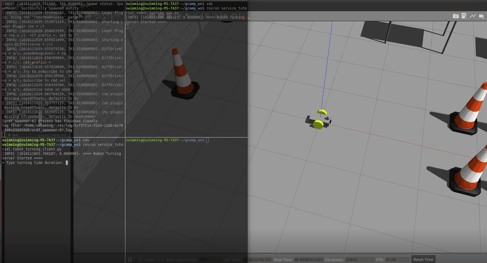

# Gcamp ROS Basic

## ROS1 Basics with Gazebo Simulations

<p align="center">
    
    
    
</p>

There's Lecture note for all codes, all packages (**Written in Korean**) 
- [Lecture Note Notion Link](https://www.notion.so/ROS-for-G-Camp-410d95df137d403ca176cfec4822351a)

There's Also Youtube Lectures for all about this repo (**Also spoken in Korean**) 
- [Youtube Lecture Link](https://www.youtube.com/watch?v=j2kBX8G6-bY&list=PL403sAX76vtd8lcGsn9vH22aRXu7Vmf9G)


## Repo Structure

```
├── topic_tutorial
├── service_tutorial
├── action_tutorial
├── cpp_topic_tutorial
├── cpp_service_tutorial
├── cpp_action_tutorial
├── GazeboFiles
│   ├── models
│   ├── textures
│   └── world
└── gcamp_gazebo
```

* Gazeobo Package with Worlds and Robot.
* Three Python Packages for each ROS Communication Mechanisms
  - Topic
  - Service
  - Action
* Also Same Three Packages written in C++

> Feel Free to use this repo as an template code 😀

## Examples

### **1. Parking**

Use ROS topical `publish` and `subscribe` to park the robot correctly in the simulation.

* LidarScan data Subscribe
* Cmd_vel publish
* Gazebo

<p align="center">
    
</p>

### **2. Spawn r2d2**

Use ROS `service` to bring a robot into the simulation.

* ROS Gazebo Service
* Service Client
* URDF 

<p align="center">
    
</p>

### **3. Turn Robot**

Use ROS `service` to rotate the robot at a certain angle.

* Service Client & Server
* ROS Coordination

<p align="center">
    
</p>


### **4. Maze Escape**

Use ROS `action` to get the robot out of the maze.

<p align="center">
</p>

* Action Client & Server 
* ROS odom
* OpenCV

---

## Created by kimsooyoung
* Github Account : [kimsooyoung](https://github.com/kimsooyoung)
